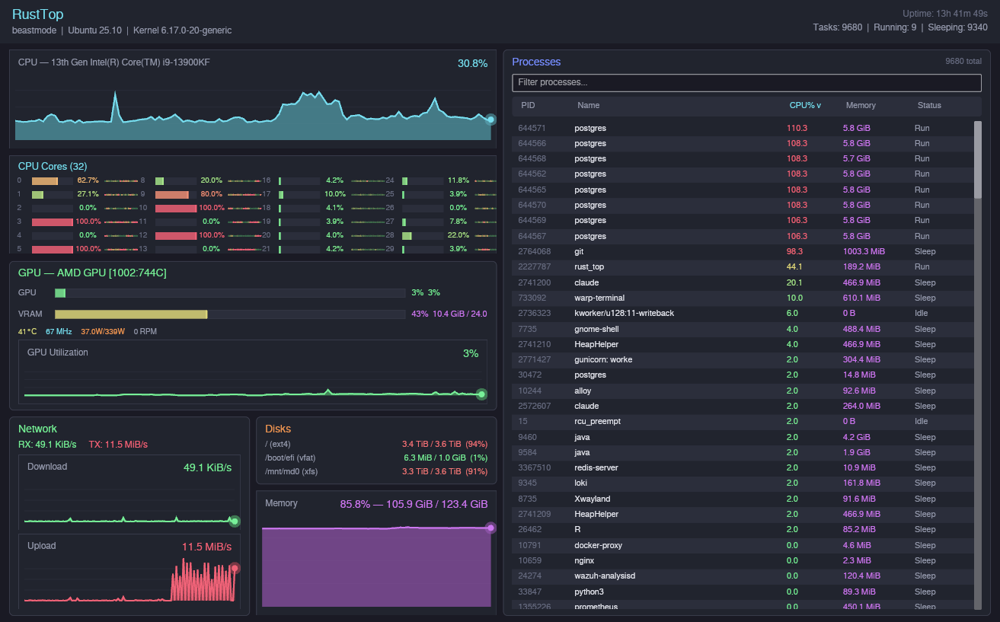

<p align="center">
  
</p>

<h1 align="center">RustTop</h1>

<p align="center">
  <strong>A gorgeous, GPU-accelerated system monitor that makes <code>htop</code> look like it's from 1997.</strong>
</p>

<p align="center">
  <a href="#features">Features</a> &bull;
  <a href="#installation">Installation</a> &bull;
  <a href="#building-from-source">Build</a> &bull;
  <a href="#architecture">Architecture</a> &bull;
  <a href="ROADMAP.md">Roadmap</a>
</p>

---



## Why RustTop?

Because your system deserves better than green text on a black background.

RustTop is a real-time system monitor built in Rust with the [iced](https://github.com/iced-rs/iced) GUI framework. It renders at 60fps using your GPU, looks stunning on everything from a laptop to a 4K ultrawide, and gives you everything you need to see what your machine is actually doing -- all in a single, dynamically-scaling window with zero scrolling.

## Features

- **CPU** -- Full-width utilization graph with history, plus a btop-style per-core view with 4-column bars and activity dot sparklines. Supports up to 128 cores without breaking a sweat.
- **Memory** -- Usage graph with percentage, used/total breakdown. Lives next to your disk info so you can see storage and RAM at a glance.
- **GPU (AMD + NVIDIA)** -- Auto-discovers AMD GPUs via sysfs and NVIDIA GPUs via NVML. Shows utilization and VRAM as compact horizontal bars, plus a history graph. Temperature, clock speed, power draw, and fan stats in a tight stats row. *(Gracefully shows "No GPU detected" when none found.)*
- **Network** -- Per-interface RX/TX rate sparklines. Scales dynamically from idle to saturated links.
- **Disks** -- Mount point, filesystem type, used/total, and heat-colored usage percentages. Warns you before you hit 100%.
- **Processes** -- Sortable by PID, name, CPU%, memory, or status. Filterable with a live search box. Keyboard-navigable with arrow keys and kill support. Shows up to 200 processes with selection highlighting.
- **Dynamic Layout** -- Every panel uses proportional fill. Resize the window, go fullscreen on 4K, or squeeze it onto a laptop -- it adapts. No scrolling required.
- **Keyboard Shortcuts** -- `q` quit, `/` filter, arrow keys to select, `k`/`Del` to kill, `F1`-`F5` to sort, `Tab` to reverse. Help bar at the bottom.
- **Dark Tokyo Night Theme** -- Neon cyan, magenta, green, orange, and red accents on a deep dark background. Heat-colored indicators shift from green to yellow to red as values climb.

## Installation

### From GitHub Releases (Recommended)

Download the latest release binary or `.deb` from the [Releases page](https://github.com/sudoshi/RustTop/releases).

```bash
# Binary
chmod +x rust_top-linux-amd64
./rust_top-linux-amd64

# Or .deb package
sudo apt install ./rust-top_*.deb
```

Then run `rust_top` from your terminal or find **RustTop** in your application launcher.

### From crates.io

```bash
cargo install rust_top
```

### From Source

See [Building from Source](#building-from-source) below.

## Building from Source

### Prerequisites

**Rust toolchain:**
```bash
curl --proto '=https' --tlsv1.2 -sSf https://sh.rustup.rs | sh
```

**System dependencies (Ubuntu/Debian):**
```bash
sudo apt install -y build-essential pkg-config libfontconfig1-dev \
    libxkbcommon-dev libwayland-dev libvulkan-dev
```

### Build & Run

```bash
git clone https://github.com/sudoshi/RustTop.git
cd RustTop
cargo build --release
./target/release/rust_top
```

### Build .deb Package

```bash
cargo install cargo-deb
cargo deb
sudo apt install ./target/debian/rust-top_*.deb
```

## Architecture

```
src/
├── main.rs                    # Entry point, window config, icon
├── metrics/                   # Data collection (no GUI code here)
│   ├── collector.rs           # SystemMetrics orchestrator
│   ├── cpu.rs                 # Per-core usage + history tracking
│   ├── memory.rs              # RAM + swap metrics
│   ├── disk.rs                # Mount point enumeration
│   ├── network.rs             # Interface RX/TX rates
│   ├── gpu.rs                 # GPU metrics (AMD sysfs + NVIDIA NVML)
│   └── process.rs             # Process list with sort/filter
├── theme/
│   ├── mod.rs                 # Custom iced dark theme
│   └── colors.rs              # Full palette + heat_color() + lerp
└── ui/
    ├── app.rs                 # Main app state, update, view, subscription
    └── widgets/               # All visual components
        ├── graph.rs           # Canvas sparkline with gradient fill + glow dot
        ├── gauge.rs           # Arc gauge with heat coloring (available, unused)
        ├── cpu_cores.rs       # btop-style 4-column per-core bars + activity dots
        ├── gpu_view.rs        # Horizontal bars + stats + utilization graph
        ├── header.rs          # System info bar (hostname, kernel, uptime)
        ├── disk_bar.rs        # Disk usage with heat-colored percentages
        ├── network_view.rs    # RX/TX sparkline graphs
        └── process_table.rs   # Sortable, filterable process list
```

Clean separation: `metrics/` knows nothing about the GUI. `ui/widgets/` knows nothing about how data is collected. `app.rs` wires them together.

## Tech Stack

| Component | Choice | Why |
|-----------|--------|-----|
| Language | Rust | Speed, safety, no GC pauses |
| GUI | [iced](https://github.com/iced-rs/iced) 0.13 | GPU-accelerated, pure Rust, Elm architecture |
| System info | [sysinfo](https://github.com/GuillaumeGomez/sysinfo) | Cross-platform CPU/mem/disk/network/process |
| AMD GPU | Raw sysfs reads | Zero dependencies, auto-discovery via vendor ID `0x1002` |
| NVIDIA GPU | [nvml-wrapper](https://crates.io/crates/nvml-wrapper) | Dynamic NVML loading, auto-discovery at runtime |
| Rendering | wgpu (GPU) / tiny-skia (CPU fallback) | Hardware acceleration with graceful fallback |

## Troubleshooting

**No GPU panel?** AMD GPUs are detected via `/sys/class/drm/card*/device/`. NVIDIA GPUs are detected via NVML (requires NVIDIA drivers). If no GPU is found, the panel shows a friendly "No GPU detected" message.

**Wayland vs X11?** RustTop works on both. If you hit rendering issues on Wayland, force X11:
```bash
WAYLAND_DISPLAY= ./target/release/rust_top
```

**Icon not showing in dock?** The app sets the Wayland app-id to `rust_top` to match the desktop file. If the icon still doesn't appear, try:
```bash
gtk-update-icon-cache -f -t /usr/share/icons/hicolor
```

## License

MIT

## Contributing

PRs welcome. The codebase is small (~2500 lines of Rust) and well-organized. If you want to add Intel GPU support, Windows compatibility, or a new widget -- go for it.
