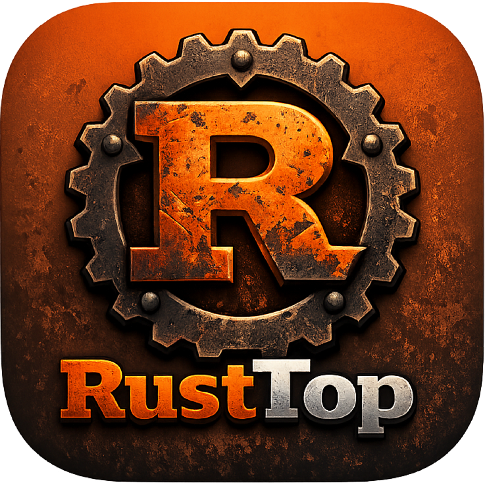

<p align="center">
  
</p>

<h1 align="center">RustTop</h1>

<p align="center">
  <strong>A gorgeous, GPU-accelerated system monitor that makes <code>htop</code> look like it's from 1997.</strong>
</p>

<p align="center">
  <a href="#features">Features</a> &bull;
  <a href="#installation">Installation</a> &bull;
  <a href="#building-from-source">Build</a> &bull;
  <a href="#architecture">Architecture</a> &bull;
  <a href="docs/api.md">API</a> &bull;
  <a href="ROADMAP.md">Roadmap</a>
</p>

---


## Why RustTop?

Because your system deserves better than green text on a black background.

RustTop is a real-time system monitor built in Rust with the [iced](https://github.com/iced-rs/iced) GUI framework. It renders at 60fps using your GPU, looks stunning on everything from a laptop to a 4K ultrawide, and gives you everything you need to see what your machine is actually doing -- all in a single, dynamically-scaling window with zero scrolling.

## Features

- **CPU** -- Full-width utilization graph with history, plus a btop-style per-core view with 4-column bars and activity dot sparklines. Supports up to 128 cores without breaking a sweat.
- **Memory** -- Usage graph with percentage, used/total breakdown. Lives next to your disk info so you can see storage and RAM at a glance.
- **GPU (AMD + NVIDIA + macOS)** -- Linux: auto-discovers AMD GPUs via sysfs, NVIDIA via NVML. macOS: reads AMD GPU metrics directly from IOKit (`ioreg`). Shows utilization and VRAM as compact horizontal bars, plus a history graph. Temperature, clock speed, power draw, and fan RPM in a tight stats row. *(Gracefully shows "No GPU detected" when none found.)*
- **Network** -- Per-interface RX/TX rate sparklines. Scales dynamically from idle to saturated links.
- **Disks** -- Mount point, filesystem type, used/total, read/write throughput, and heat-colored usage percentages. Warns you before you hit 100%.
- **Battery + Sensors** -- Linux battery status/capacity/health from power-supply sysfs, plus thermal readings from `sysinfo::Components` where the platform exposes them.
- **Processes** -- Sortable by PID, name, CPU%, memory, or status. Filterable with match highlighting, saved filters, tree/detail views, configurable signal actions, persisted column presets, keyboard navigation, and virtualized scrolling for large process lists.
- **Settings + Layouts** -- In-app settings strip with persisted layout presets, built-in theme selection, and compact mode.
- **History, Alerts + Exports** -- Persistent JSONL history, sustained-threshold in-app alerts, one-shot JSON/CSV snapshots, and incident bundle export for scripts, reports, and capture. Desktop notifications are still planned.
- **Optional Local API** -- Default-off headless HTTP API with versioned JSON snapshots, active alerts, health checks, and Prometheus text metrics. Loopback-only by default; non-loopback binds require a bearer token.
- **Dynamic Layout** -- Every panel uses proportional fill. Resize the window, go fullscreen on 4K, or squeeze it onto a laptop -- it adapts, with independent process-table scrolling for large hosts.
- **Keyboard Shortcuts** -- `q` quit, `,` settings, `/` filter, arrow keys select, `k`/`Del` guarded process action, `s` signal, `Enter` details, `t` tree, `f`/`w` saved filters, `c` columns, `l` layout, `m` compact, `g` theme, `F1`-`F5` sort, `Tab` reverse.
- **Dark Tokyo Night Theme** -- Neon cyan, magenta, green, orange, and red accents on a deep dark background. Heat-colored indicators shift from green to yellow to red as values climb.

## Installation

### macOS (Hackintosh & native)

```bash
git clone https://github.com/sudoshi/RustTop.git
cd RustTop
./scripts/build-macos-app.sh --install
```

This builds the release binary, generates a proper `.icns` icon, assembles `RustTop.app`, and installs it to `/Applications`. Double-click it from Finder or Spotlight.

> **First launch:** macOS may warn about an unidentified developer. Right-click → Open to bypass, or run `xattr -cr /Applications/RustTop.app`.

AMD GPU support on macOS is provided natively via IOKit — no extra drivers needed. Tested on AMD RX 6900 XT (Navi 21) on Hackintosh.

### Linux — From GitHub Releases (Recommended)

Download the latest release binary or `.deb` from the [Releases page](https://github.com/sudoshi/RustTop/releases).

```bash
# Binary
chmod +x rust_top-linux-amd64
./rust_top-linux-amd64

# Or .deb package
sudo apt install ./rust-top_*.deb
```

Then run `rust_top` from your terminal or find **RustTop** in your application launcher.

### From crates.io

The crate is not published yet. Until crates.io publication is complete, install from source or use release artifacts.

### From Source

See [Building from Source](#building-from-source) below.

## Building from Source

### Prerequisites

**Rust toolchain:**
```bash
curl --proto '=https' --tlsv1.2 -sSf https://sh.rustup.rs | sh
```

**System dependencies (Ubuntu/Debian):**
```bash
sudo apt install -y build-essential pkg-config libfontconfig1-dev \
    libxkbcommon-dev libwayland-dev libvulkan-dev
```

**macOS:** No extra system dependencies — Xcode Command Line Tools and Rust are sufficient.

### Build & Run

```bash
git clone https://github.com/sudoshi/RustTop.git
cd RustTop
cargo build --release
./target/release/rust_top

# One-shot snapshot export for scripts or reports
./target/release/rust_top --no-gpu --export-json snapshot.json --export-csv snapshot.csv

# Append one snapshot to local JSONL history or create a bundle directory
./target/release/rust_top --record-history
./target/release/rust_top --incident-bundle rusttop-incident

# Configure sustained in-app alerts in your config file
# [alerts]
# enabled = true
# min_duration_seconds = 10
# cpu_percent = 90.0
# memory_percent = 90.0
# disk_used_percent = 90.0

# Start the default-off local API in headless mode
./target/release/rust_top --api --api-addr 127.0.0.1:9977 --api-token local-dev-token
curl -H "Authorization: Bearer local-dev-token" http://127.0.0.1:9977/api/v1/snapshot
curl -H "Authorization: Bearer local-dev-token" http://127.0.0.1:9977/metrics

# macOS: build a double-clickable .app bundle
./scripts/build-macos-app.sh --install
```

### Build .deb Package

```bash
cargo install cargo-deb
cargo deb
sudo apt install ./target/debian/rust-top_*.deb
```

## Architecture

```
src/
├── api.rs                     # Default-off local HTTP API and Prometheus text endpoint
├── alerts.rs                  # Sustained-threshold alert engine
├── config.rs                  # TOML config, CLI, runtime options
├── export.rs                  # JSON/CSV snapshots, JSONL history, bundles
├── main.rs                    # Entry point, window config, icon
├── metrics/                   # Data collection (no GUI code here)
│   ├── collector.rs           # SystemMetrics orchestrator
│   ├── cpu.rs                 # Per-core usage + history tracking
│   ├── memory.rs              # RAM + swap metrics
│   ├── disk.rs                # Mount points + disk I/O rates
│   ├── network.rs             # Timestamp-based interface RX/TX rates
│   ├── gpu.rs                 # GPU metrics (AMD/NVIDIA/Intel/macOS baselines)
│   ├── battery.rs             # Battery capacity/health/status
│   ├── sensors.rs             # Thermal component readings
│   ├── history.rs             # Ring-buffer metric history
│   ├── units.rs               # Shared byte/rate formatting
│   └── process.rs             # Process list with sort/filter
├── theme/
│   ├── mod.rs                 # Custom iced dark theme
│   └── colors.rs              # Full palette + heat_color() + lerp
└── ui/
    ├── app.rs                 # Main app state, update, view, subscription
    └── widgets/               # All visual components
        ├── alerts_panel.rs    # Sustained-threshold alert strip
        ├── graph.rs           # Canvas sparkline with gradient fill + glow dot
        ├── settings_panel.rs  # Layout/theme/compact/alert controls
        ├── power_sensors.rs   # Battery and sensor panels
        ├── cpu_cores.rs       # btop-style 4-column per-core bars + activity dots
        ├── gpu_view.rs        # Horizontal bars + stats + utilization graph
        ├── header.rs          # System info bar (hostname, kernel, uptime)
        ├── disk_bar.rs        # Disk usage with heat-colored percentages
        ├── network_view.rs    # RX/TX sparkline graphs
        └── process_table.rs   # Sortable, filterable process list
```

Clean separation: `metrics/` knows nothing about the GUI. `ui/widgets/` knows nothing about how data is collected. `app.rs` wires them together.

## Tech Stack

| Component | Choice | Why |
|-----------|--------|-----|
| Language | Rust | Speed, safety, no GC pauses |
| GUI | [iced](https://github.com/iced-rs/iced) 0.13 | GPU-accelerated, pure Rust, Elm architecture |
| System info | [sysinfo](https://github.com/GuillaumeGomez/sysinfo) | Cross-platform CPU/mem/disk/network/process |
| AMD GPU (Linux) | Raw sysfs reads | Zero dependencies, auto-discovery via vendor ID `0x1002` |
| AMD GPU (macOS) | IOKit via `ioreg` | Reads `PerformanceStatistics` from `IOAccelerator` |
| NVIDIA GPU | [nvml-wrapper](https://crates.io/crates/nvml-wrapper) | Dynamic NVML loading, auto-discovery at runtime |
| Rendering | wgpu (GPU) / tiny-skia (CPU fallback) | Hardware acceleration with graceful fallback |

## Troubleshooting
**No GPU panel? (Linux)** AMD GPUs are detected via `/sys/class/drm/card*/device/`. NVIDIA GPUs are detected via NVML (requires NVIDIA drivers). If no GPU is found, the panel shows a friendly "No GPU detected" message.

**No GPU panel? (macOS)** Requires an IOKit `IOAccelerator` (any AMD/Intel GPU with Metal drivers). Verify with:
```bash
ioreg -r -c IOAccelerator -l -w 0 | grep PerformanceStatistics
```

**Wayland vs X11?**
**Wayland vs X11?** RustTop works on both. If you hit rendering issues on Wayland, force X11:
```bash
WAYLAND_DISPLAY= ./target/release/rust_top
```

**Icon not showing in dock? (Linux)** The app sets the Wayland app-id to `rust_top` to match the desktop file. If the icon still doesn't appear, try:
```bash
gtk-update-icon-cache -f -t /usr/share/icons/hicolor
```

**Icon not showing in macOS Dock?** Force-refresh with:
```bash
killall Finder && killall Dock
```

## License

MIT

## Contributing

PRs welcome. The codebase is small and well-organized. If you want to deepen Intel GPU telemetry, improve Windows compatibility, or add a new widget -- go for it.

**Good first contributions:**
- Intel GPU engine telemetry beyond the current Linux detection baseline
- Windows support (DirectX / NVML / AMD ADL)
- macOS Apple Silicon GPU metrics
